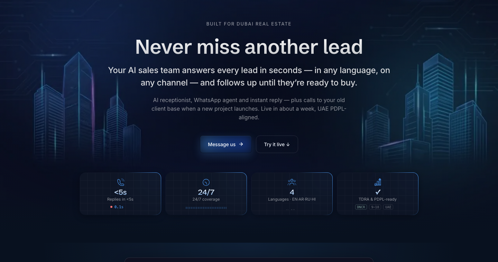
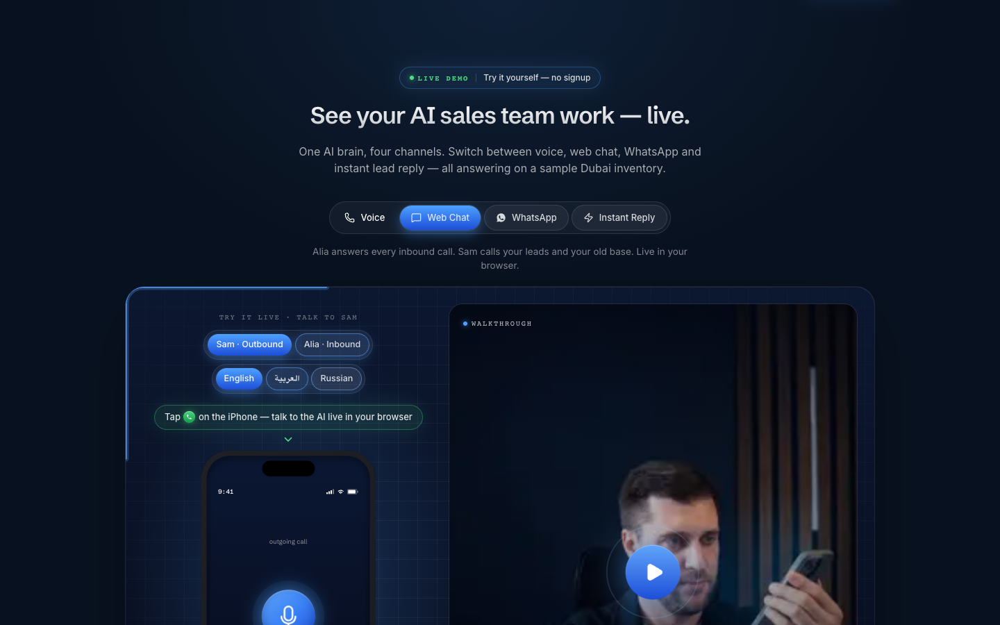
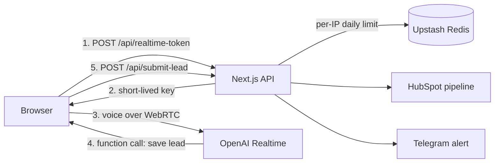
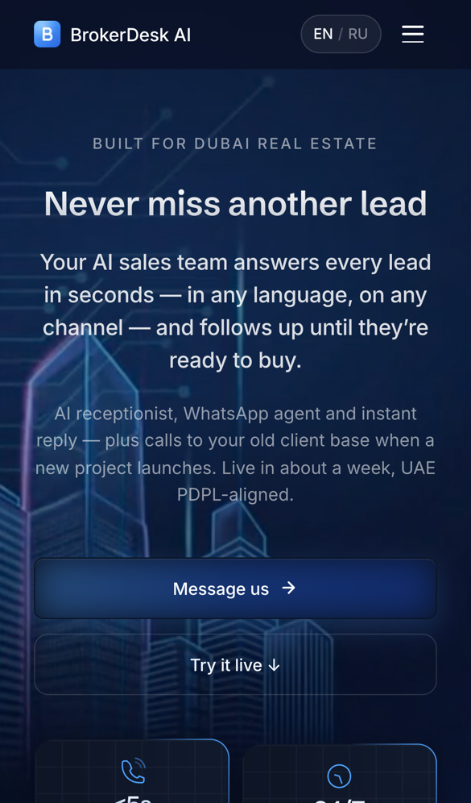

# BrokerDesk

[](https://github.com/ahrimmedia-beep/brokerdesk/actions/workflows/ci.yml)

AI sales assistant for real estate agencies in Dubai. It answers every new lead in seconds by voice, web chat and WhatsApp, qualifies the client and hands a ready lead to the agent's CRM.

**Live:** https://brokerdesk-ai.com. The voice demo runs right in the browser, no signup.



## The problem

Agencies pay for every lead, but agents often answer hours later, at night or not at all. By then the client is already talking to another agency.

## What I built

- A voice agent the client talks to right in the browser, in English, Arabic or Russian.
- Two personas: an inbound receptionist and an outbound agent that calls new leads and the old client base.
- Web chat and WhatsApp that know the same sample inventory.
- Lead qualification (budget, area, timing, cash or mortgage) and delivery to HubSpot and Telegram with a short summary of the conversation.
- The product website itself, in English and Russian, with SEO, analytics and the Meta Conversions API.



## How it works



The browser never sees the OpenAI key. The server creates a short-lived key for one session and counts sessions per IP in Redis. The voice then goes straight from the browser to OpenAI over WebRTC, so the server does not carry audio.

## Selected code

This repository holds a few real modules from the product, with their tests, to show how the code is written. The voice prompts, the knowledge base, the integrations and the deployment setup stay private.

| File | What it shows |
|---|---|
| [`src/rate-limit.ts`](src/rate-limit.ts) | Rate limiting on Upstash Redis with an in-memory fallback, and safe client IP resolution behind a proxy. Paid endpoints fail closed when Redis is down. |
| [`src/lead-log.ts`](src/lead-log.ts) | Logging that never writes a client's name, phone or email, including values that HubSpot or Telegram quote back in their error messages (UAE PDPL). |
| [`src/realtime-session.ts`](src/realtime-session.ts) | Request validation with zod and the session config for an OpenAI Realtime ephemeral key. |
| [`examples/realtime-token-route.ts`](examples/realtime-token-route.ts) | How these modules come together in the Next.js API route. Personas and tools are removed. |

```bash
npm install
npm test           # 44 tests, Node 22.18+
npm run typecheck
```

## Stack

Next.js 16 (App Router), React 19, TypeScript, Tailwind CSS, GSAP, OpenAI Realtime API over WebRTC, Upstash Redis, HubSpot API, Meta Conversions API, Vercel.

## My role

I built the product alone: product design, UI, frontend, backend, voice agents, integrations and deployment.

<p align="center"></p>

## License

Published for viewing only. All rights reserved, see [LICENSE](LICENSE).
